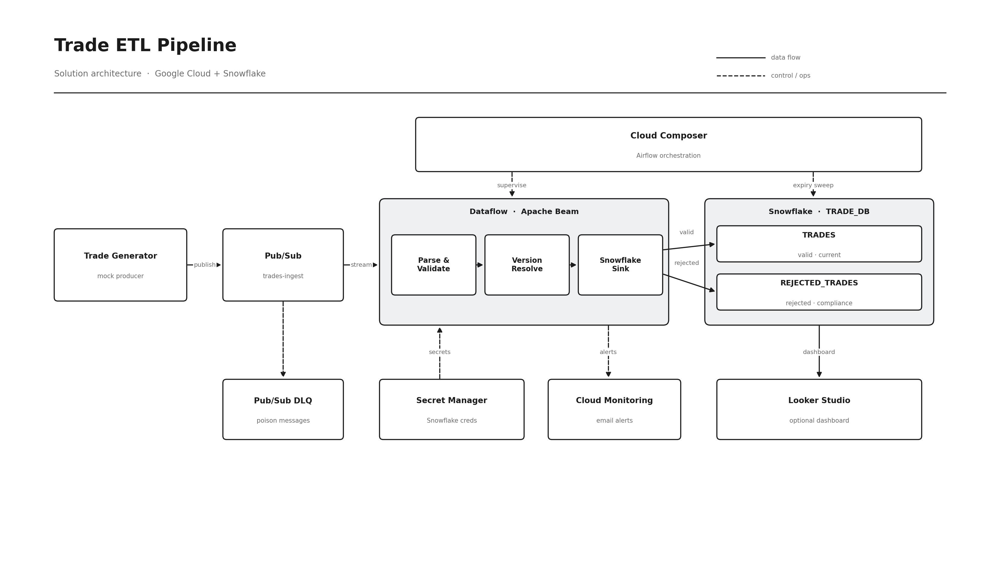

# Trade ETL Pipeline (Google Cloud + Snowflake)

This is my implementation of the trade data engineering case study. It is a
streaming pipeline that takes trade events off a message bus, validates them
against the business rules in the brief, and lands them in Snowflake — valid
trades in one table, rejected trades in a separate audit table for compliance.

The streaming layer runs on Dataflow (Apache Beam, Python), the warehouse is
Snowflake, orchestration is Cloud Composer (Airflow), and the whole environment
is provisioned with Terraform so it can be stood up or torn down repeatably.

The detail that shaped most of the design is versioning: the same trade is
re-sent over its life with an increasing version number, and the warehouse must
always hold the latest accepted version while rejecting anything older. That is
an ordered, per-trade decision, and it is the reason the processing layer is a
stateful streaming job rather than a simple batch load.

This README is the overview; the individual deliverables are written up in `docs/`:

- Architecture diagram — [`docs/architecture.jpg`](docs/architecture.jpg)
- Execution guide — [`docs/execution-guide.docx`](docs/execution-guide.docx)
- Validation logic and tech stack — [`docs/validation-and-tech-stack.docx`](docs/validation-and-tech-stack.docx)

## Architecture



Reading the diagram left to right:

A generator stands in for the upstream trade source and publishes JSON events to
a Pub/Sub topic. Pub/Sub gives durable buffering, replay inside the retention
window, and a dead-letter topic for messages that fail repeatedly.

A streaming Dataflow job reads the subscription and applies the rules in two
stages. The first stage, `ParseAndStaticValidate`, does the stateless checks: it
rejects payloads that cannot be parsed and trades whose maturity date is already
in the past at ingest. The second stage, `VersionResolve`, is stateful and keyed
by `trade_id`; it compares each incoming version against the highest version seen
for that trade and classifies it as new, an upgrade, a same-version replace, or a
stale lower version to reject.

Valid trades are upserted into the Snowflake `TRADES` table with a `MERGE`;
rejected trades are appended to `REJECTED_TRADES` with a stable reason code. Both
writes are idempotent, so retries and at-least-once delivery cannot corrupt the
warehouse or duplicate audit rows.

Cloud Composer supervises the long-running streaming job, runs the scheduled
expiry sweep that flips matured trades from `ACTIVE` to `EXPIRED`, and records
each run in `PIPELINE_AUDIT`. Cloud Monitoring watches the Dataflow job and the
dead-letter queue and sends an email when something goes wrong. Reporting views
over the two tables feed an optional Looker Studio dashboard.

## Design decisions

I kept to managed, cloud-native services so the operational surface stays small,
and chose each component for a specific reason rather than defaulting to it.

Pub/Sub is the messaging layer because it is a native Dataflow source, it retains
messages for replay, and its dead-letter support means a single poison message
cannot stall the stream.

Dataflow with Apache Beam is the processing engine because the version rule needs
ordered, per-key state. Beam's stateful `DoFn` processes all events for one
`trade_id` on a single worker in order, which is exactly what "reject anything
older than what we've already accepted" requires. Dataproc/Spark could do the
same but is heavier to run, and Data Fusion's low-code model gives less control
over custom stateful logic, so neither earned the trade-off here.

Snowflake is the warehouse because `MERGE` gives clean upsert semantics for a
latest-version table, it is straightforward to keep valid and rejected trades in
separate tables, and reporting views sit naturally on top for the dashboard.

Cloud Composer runs the orchestration — supervising the streaming job, running
the scheduled sweep, and providing `email_on_failure`. It is the most expensive
component in the stack, so it is deliberately optional: setting
`enable_composer = false` skips it, and the expiry sweep is a single idempotent
SQL statement that any scheduler can run.

Snowflake credentials never live in code. They sit in Secret Manager and are read
at worker startup by a least-privilege service account, using key-pair auth for
the service user. Everything is described in Terraform so the environment is
reviewable and reproducible.

## Validation and business rules

The four rules from the brief are split between the streaming job, which handles
the per-event checks in real time, and a scheduled Snowflake sweep, which handles
the time-based expiry. Every rejection, wherever it happens, is written to
`REJECTED_TRADES` with a stable reason code so it can be grouped and audited.

| Rule | Behaviour | Where | Reason code |
|------|-----------|-------|-------------|
| Malformed payload | reject if it can't be parsed | `ParseAndStaticValidate` | `MALFORMED_PAYLOAD` |
| Past maturity at ingest | reject if `maturity_date < today` | `ParseAndStaticValidate` | `PAST_MATURITY_AT_INGEST` |
| Lower version | reject if incoming version < latest seen | `VersionResolve` | `LOWER_VERSION` |
| Same version | replace the existing record | `VersionResolve` | — |
| Higher version | accept as new or an upgrade | `VersionResolve` | — |
| Expiry | flip `ACTIVE` to `EXPIRED` once matured | `expiry_sweep.sql` | — |

There are two points worth calling out, because they are where a naive
implementation would lose data.

The first is that the version check is enforced twice. The streaming state is the
fast path, but it can be lost if the job is fully replaced. So the Snowflake
`MERGE` re-applies the same guard (`WHEN MATCHED AND s.version >= t.version`); a
restart that loses in-pipeline state still cannot overwrite a newer trade with an
older one. The warehouse is the final arbiter.

The second is idempotency. Valid trades are merged on `trade_id`, so re-applying
a batch is a no-op. Rejected trades are inserted with a `reject_id` that is a
SHA-256 hash of the rejection's content, and because the rejection timestamp is
stamped once at validation time, the same rejection always hashes to the same id.
A retried write therefore cannot create duplicate audit rows.

## Data model

Three tables and two views, all created by `src/snowflake/ddl.sql`:

- `TRADES` — one row per `trade_id`, holding the latest accepted version and its
  status (`ACTIVE` or `EXPIRED`).
- `REJECTED_TRADES` — append-only audit log; keeps the original payload and the
  reason so rejections can be investigated or replayed.
- `PIPELINE_AUDIT` — a row per orchestration action (expiry sweep, health check).
- `V_TRADE_STATUS_SUMMARY` and `V_REJECTION_SUMMARY` — aggregates for reporting.

## Repository layout

```
src/generator/      mock trade producer -> Pub/Sub
src/pipeline/       Beam pipeline + Snowflake sink + Flex Template build files
  transforms/       validation rules (unit-tested)
src/snowflake/      DDL (tables + reporting views) + expiry sweep SQL
orchestration/      Airflow DAG + SQL (deployed to Composer)
terraform/          network, pubsub, iam, storage, monitoring, composer modules
scripts/            build Flex Template, launch pipeline, deploy DAGs
tests/              pytest unit tests (run on the Beam DirectRunner)
```

`trade_schema.py` appears in both `src/generator/` and `src/pipeline/` on
purpose. Dataflow packages the pipeline directory and ships it to workers as flat
modules, so the schema has to physically sit next to `pipeline.py`. The two
copies are identical; the pipeline copy is the source of truth and any change
should be mirrored to the generator copy.

## Setup and execution

Prerequisites: a GCP project with billing enabled, an authenticated `gcloud`,
Terraform >= 1.5, Python 3.11, and a Snowflake account.

### 1. Provision infrastructure

```bash
cd terraform
cp terraform.tfvars.example terraform.tfvars   # fill in project_id, alert_email, snowflake creds
terraform init
terraform apply
```

This creates the VPC + Cloud NAT, Pub/Sub topic/subscription/DLQ, the
least-privilege service accounts, the Snowflake-credentials secret, GCS buckets,
Cloud Monitoring alerts, and (optionally) the Composer environment. Note the
outputs — several feed the scripts below.

### 2. Create the Snowflake schema

Run the DDL once in a Snowflake worksheet (or via SnowSQL):

```sql
-- src/snowflake/ddl.sql
```

It creates `TRADES`, `REJECTED_TRADES`, `PIPELINE_AUDIT`, and the reporting views.

### 3. Build and launch the streaming pipeline

```bash
export PROJECT_ID=...  REGION=us-central1  ENV=dev
export ARTIFACTS_BUCKET=$(terraform -chdir=terraform output -raw artifacts_bucket)
scripts/build_flex_template.sh

export DATAFLOW_BUCKET=$(terraform -chdir=terraform output -raw dataflow_bucket)
export SUBSCRIPTION=$(terraform -chdir=terraform output -raw pubsub_subscription_id)
export SNOWFLAKE_SECRET=$(terraform -chdir=terraform output -raw snowflake_secret_resource)
export DATAFLOW_SA=$(terraform -chdir=terraform output -raw dataflow_sa_email)
export SUBNET=$(terraform -chdir=terraform output -raw subnet_self_link)
scripts/launch_pipeline.sh        # job name defaults to "trade-etl-streaming"
```

The launch script uses the same fixed job name the DAG expects, so the Composer
health check recognises a manually-launched job and won't start a duplicate.

### 4. Deploy the orchestration DAG

```bash
export DAG_GCS_PREFIX=$(terraform -chdir=terraform output -raw dag_gcs_prefix)
export FLEX_TEMPLATE_PATH="gs://${ARTIFACTS_BUCKET}/flex-templates/trade-etl-${ENV}.json"
export DATAFLOW_TEMP_LOCATION=$(terraform -chdir=terraform output -raw dataflow_temp_location)
scripts/deploy_dags.sh
```

Then create the `snowflake_default` Airflow connection in the Composer UI (or via
CLI) so the expiry/audit SQL tasks can reach Snowflake.

### 5. Generate trade data

```bash
cd src/generator
pip install -r requirements.txt
python -m generator.generate \
    --project_id "$PROJECT_ID" \
    --topic_id "$(terraform -chdir=../../terraform output -raw pubsub_topic)" \
    --num_trades 200 --rate_per_sec 25 --scenario mixed
```

Scenarios: `valid`, `past_maturity`, `versions`, `mixed` (default). Use `--seed`
for a reproducible run.

### 6. Verify

```sql
SELECT status, COUNT(*) FROM TRADES GROUP BY status;          -- ACTIVE / EXPIRED
SELECT rejection_reason, COUNT(*) FROM REJECTED_TRADES GROUP BY rejection_reason;
SELECT * FROM V_TRADE_STATUS_SUMMARY;
SELECT * FROM V_REJECTION_SUMMARY;
```

## Configuration reference

The DAG reads its operational config from Airflow Variables at task time, set by
`scripts/deploy_dags.sh`: `gcp_project_id`, `gcp_region`,
`dataflow_flex_template_gcs_path`, `dataflow_temp_location`,
`pubsub_input_subscription`, `snowflake_secret_resource`, `dataflow_sa_email`,
`dataflow_subnet`, and the optional `dataflow_job_name` (defaults to
`trade-etl-streaming`).

`ALERT_EMAIL` and `SNOWFLAKE_CONN_ID` are read at DAG parse time, so they are set
as Composer environment variables by the Terraform composer module rather than as
Airflow Variables.

The Snowflake credentials are a JSON blob in Secret Manager. Both password and
key-pair auth are supported; key-pair is preferred for the service user — paste
the PEM as `private_key` and the sink converts it to the DER bytes the connector
needs.

## Monitoring and alerting

Cloud Monitoring carries the alerting. Terraform creates three policies — Dataflow
job failed, system lag over 300 seconds, and dead-letter backlog — all wired to an
email channel, which covers the "email on pipeline failure" requirement with no
extra setup. Airflow's `email_on_failure` is also configured and sends mail when a
SendGrid key is supplied; otherwise the Cloud Monitoring alerts are the safety net.

For observability beyond alerts, `PIPELINE_AUDIT` records each sweep and
health-check run, and the pipeline emits Beam counters (`valid_trades`,
`malformed_trades`, `lower_version_trades`, and so on) that are visible in the
Dataflow UI.

## Optional dashboard

`ddl.sql` creates `V_TRADE_STATUS_SUMMARY` (counts and notional by status) and
`V_REJECTION_SUMMARY` (counts by rejection reason). Pointing Looker Studio or
Tableau at Snowflake and these two views gives a simple valid / expired / rejected
view of the book.

## Tests

```bash
pip install -r requirements-dev.txt
pytest tests/ -v
```

The suite runs entirely on the Beam DirectRunner with in-memory data, so it needs
no GCP or Snowflake connection. It covers every validation rule (malformed,
past-maturity, version upgrade/replace/lower), the dedupe and version guard in the
valid `MERGE`, reject-path idempotency, and the retry behaviour.

## Teardown

```bash
terraform -chdir=terraform destroy
```

Cancel the Dataflow job from the console or CLI first if it is still running.
Composer is the most expensive resource, so while iterating it is worth setting
`enable_composer = false` in `terraform.tfvars` to avoid that cost.
